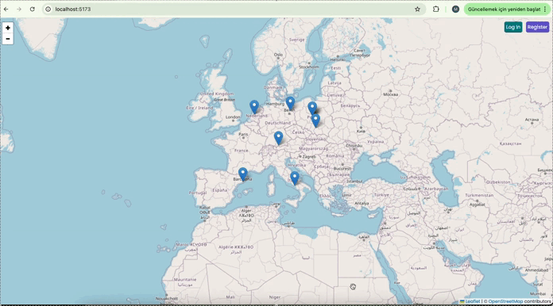

# 🗺️ "LETS GO!" - Interactive Travel Map Application 🚀

My latest full-stack project - a dynamic travel mapping application that combines modern web technologies with real-world functionality!

# 🌍 What I Built:

Interactive world map using React Leaflet

User authentication system with secure password hashing

Real-time pin creation and location sharing

Rating and review system for travel destinations

Responsive design with modern UI/UX

# 🛠️ Tech Stack:

Frontend: React 19, Vite, React Leaflet, Axios, React Icons

Backend: Node.js, Express.js, MongoDB, Mongoose

Security: bcrypt for password hashing, JWT-ready architecture

Styling: Custom CSS with modern design patterns

# ✨ Key Features:

✅ User registration and login with persistent sessions

✅ Double-click to add travel pins on the map

✅ Rate locations (1-5 stars) with detailed reviews

✅ View all community-shared travel experiences

✅ Real-time data persistence with MongoDB

✅ Responsive design that works on all devices

# �� What I Learned:

Full-stack development with modern JavaScript ecosystem

Interactive mapping and geolocation APIs

User authentication and session management

RESTful API design and implementation

Database modeling with Mongoose schemas

State management in React applications

This project demonstrates my ability to build complete, production-ready applications from concept to deployment. Every feature is fully functional and ready for real-world use!

# Preview of the project

